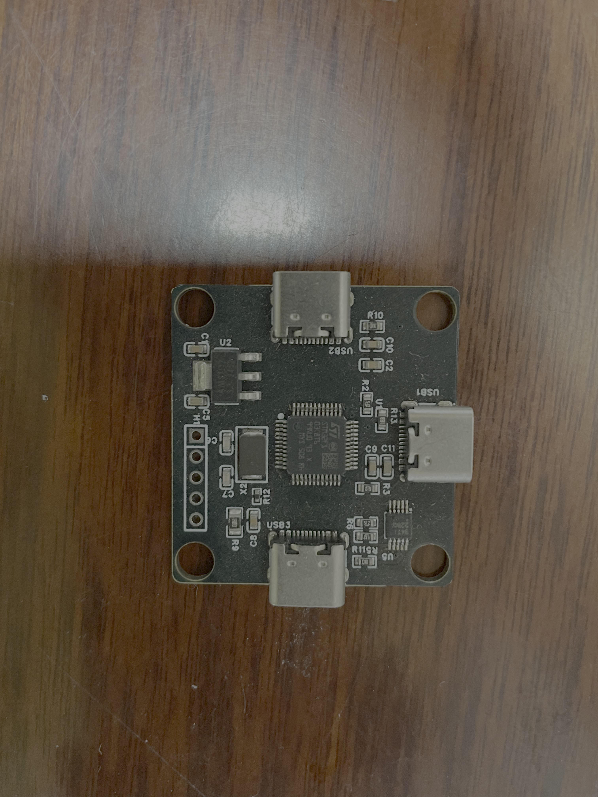
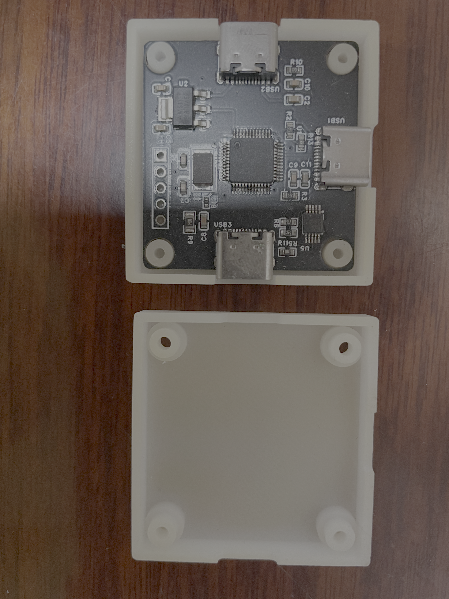

# power_meter
- 简易功耗仪

## IMAGE

## 目标
- 设计一个嵌入式功耗仪电路原理图，主要用来测量电路中的电压和电流，使用电压不超过12V。要求：1、使用STM32做主MCU。2、电流量程在1ua~100ma之间。3、要求电流在1ua~100ua的时候精度误差小于0.5ua，100ua~1ma之间误差为小于3ua，1ma~10ma的时候误差小于0.1ma，在10ma~100ma的时候误差小于1ma。电压小于6V的时候检测误差不超过0.1V。4、尽可能的节省成本。

## 设计思路
### 硬件
- 原理图在doc下面。
- 使用3个type-c口，其中一个用来给整个系统供电和上位机通讯，另外两个用于电源的输入输出。
- 计量芯片使用INA228.有点贵，自己玩玩的买来试试。
- 主控芯片使用大众的stm32f103c8t6。（便宜，网上资料多，移植USB驱动更加方便），使用USB HID，然后自定义数据传输协议。
- I2C总线需要上拉电阻(4.7K)
- RST引脚接个上拉电阻接到VCC
- INA228的IN+需要加电容，防止干扰
- USB的type-c接口两个DN和DP不需要短接，用其中一个即可
- INA228的分流电阻改成1欧

### 软件
- 软件没啥特别的，就电流数据读取的时候可以取多个值求平均之类的来优化一下。

## TODO
- 没有电流自动换挡功能，最好后续能加上。

